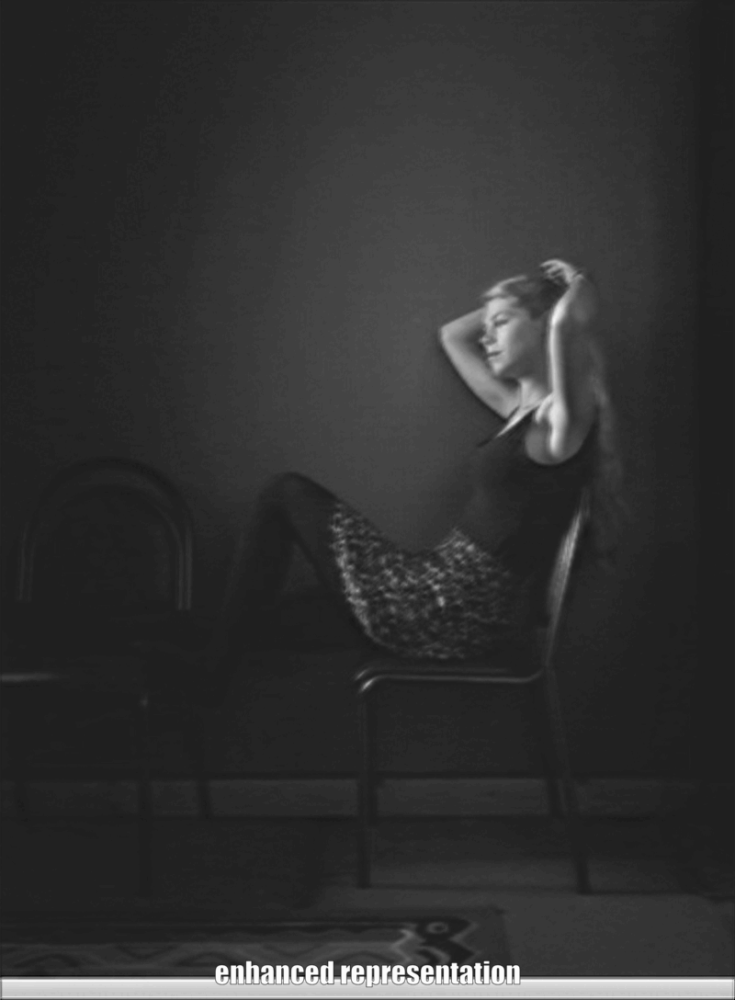

[](https://openaccess.thecvf.com/content/ICCV2023/papers/Hashmi_FeatEnHancer_Enhancing_Hierarchical_Features_for_Object_Detection_and_Beyond_Under_ICCV_2023_paper.pdf)
[](https://openaccess.thecvf.com/content/ICCV2023/supplemental/Hashmi_FeatEnHancer_Enhancing_Hierarchical_ICCV_2023_supplemental.pdf)
[](https://khurramhashmi.github.io/FeatEnHancer/)


<h1>[ICCV 2023] FeatEnHancer: Enhancing Hierarchical Features for Object Detection and Beyond Under Low-Light Vision</h1>

-----
### Complete Process from Low-light input to final prediction.
<div align="center">
  <table>
      <td>
        
      </td>
  </table>
</div>

-----

## Installation

Please refer to [low-light-object-detection-detectron2](https://github.com/khurramHashmi/FeatEnHancer_ICCV/tree/main/low-light-object-detection-detectron2#readme) for installation requirements

## Datasets

### ExDark

Create a new folder named "exdark" in the "low-light-object-detection-detectron2/data" folder.
Create a new folder named "exdark" in the "low-light-object-detection-mmdetection/data" folder.

Download the [ExDark](https://github.com/cs-chan/Exclusively-Dark-Image-Dataset) dataset and copy the images into "low-light-object-detection-detectron2/data/exdark/images/" and "low-light-object-detection-mmdetection/data/exdark/images/" folders.


### DARK FACE

Create a new folder named "darkface" in the "low-light-object-detection-detectron2/data" folder.
Create a new folder named "darkface" in the "low-light-object-detection-mmdetection/data" folder.

Download the [DARK FACE](https://flyywh.github.io/CVPRW2019LowLight/) dataset and copy the images into "low-light-object-detection-detectron2/data/darkface/images/" and "low-light-object-detection-mmdetection/data/darkface/images/" folders.


## Train

To train the ExDark and DARK FACE using FeatEnHancer based Featurized Query R-CNN run the following commands:
The training utilizes 2 GPU's

```
sh low-light-object-detection-detectron2/train_exdark.sh
sh low-light-object-detection-detectron2/train_darkface.sh
```

To train the ExDark and DARK FACE using FeatEnHancer based RetinaNet run the following commands:
The training utilizes 6 GPU's

```
sh low-light-object-detection-mmdetection/exec_script_exdark.sh
sh low-light-object-detection-mmdetection/exec_script_darkface.sh
```


## Results and Checkpoints

### ExDark

| Model                                 | mAP | Config |  
|:--------------------------------------|  :---:  |:---:  |
| FeatEnHancer + Featurized Query R-CNN | 86.3 | [config](low-light-object-detection-detectron2/configs/exdark_config.yaml) | 
### DARK FACE

| Model    | mAP | Config | 
| :---     |  :---:  |:---:  |
| FeatEnHancer + Featurized Query R-CNN | 69.0 | [config](low-light-object-detection-detectron2/configs/darkface_config.yaml) | 


### Reproducing Results on Other Downstream Vision Tasks:
* The models developed for other downstream tasks, such as Semantic Segmentation and Video Object Detection, utilize distinct frameworks (MMDet, MMSeg, and MMTracking). Hence, it was not possible to release a unified repository at this time. However, to facilitate reproducibility of results, the same [FeatEnHancer script](low-light-object-detection-detectron2/queryrcnn/featenhancer/feat_enhancer.py) can be employed across these different tasks.


## Acknowledgment

This work would not be possible without the following codebases. We gratefully thank the authors and collaborators for their wonderful works:  
[Featurized Query R-CNN](https://github.com/hustvl/Featurized-QueryRCNN/), 
[detectron2](https://github.com/facebookresearch/detectron2),
[mmdetection](https://github.com/open-mmlab/mmdetection/tree/2.x),
[mmsegmentation](https://github.com/open-mmlab/mmsegmentation), and
[mmtracking](https://github.com/open-mmlab/mmtracking/tree/1.x)


## License
The proposed FeatEnHancer is released under the [Creative Commons Attribution-NonCommercial 4.0 International Licence](LICENSE).


## Citation

If you find FeatEnHancer useful in your research or applications, please consider giving us a star :star: and citing it by the following BibTeX entry.

```bibtex
@InProceedings{FeatEnHancer_Hashmi_ICCV23,
    author    = {Hashmi, Khurram Azeem and Kallempudi, Goutham and Stricker, Didier and Afzal, Muhammad Zeshan},
    title     = {FeatEnHancer: Enhancing Hierarchical Features for Object Detection and Beyond Under Low-Light Vision},
    booktitle = {Proceedings of the IEEE/CVF International Conference on Computer Vision (ICCV)},
    month     = {October},
    year      = {2023},
    pages     = {6725-6735}
}
```